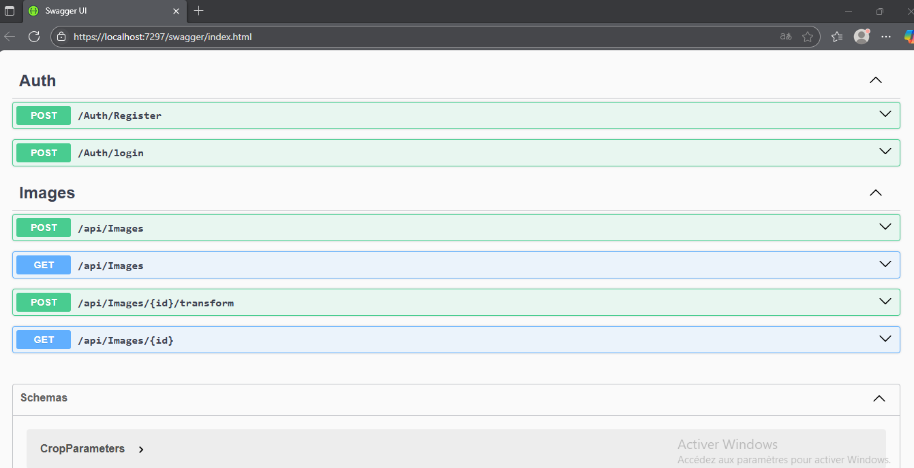
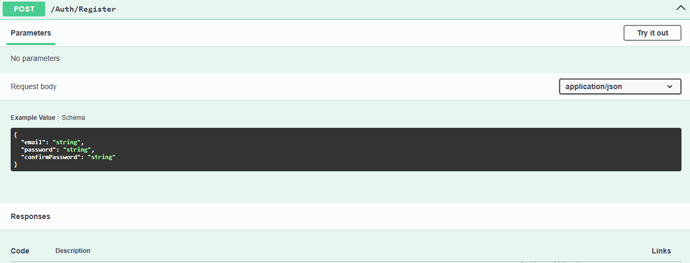
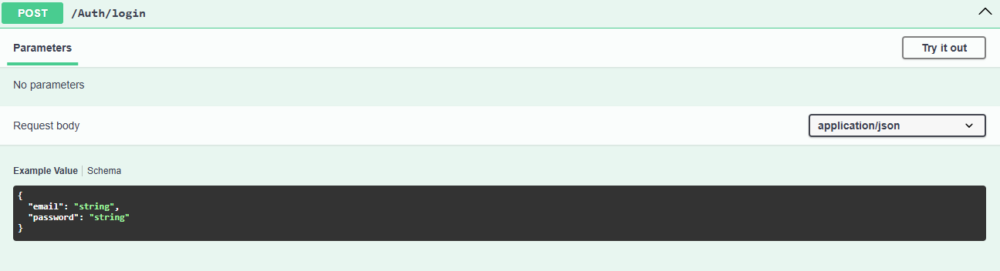
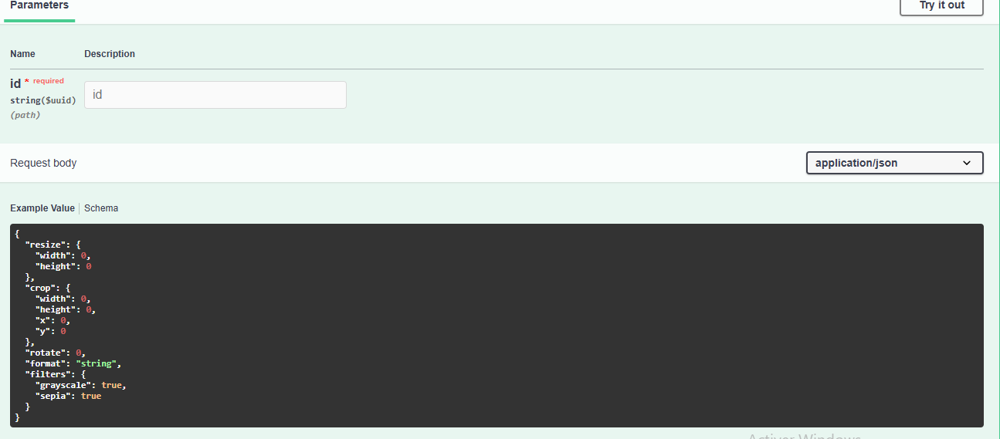

# 📸 Service_Image.api

## Description

**Service_Image.api** est une API backend avancée pour la gestion et la transformation d'images, inspirée de services comme Cloudinary.  
Cette API permet aux utilisateurs de **téléverser**, **transformer**, **récupérer** et **lister** des images de manière sécurisée et performante.

Ce projet démontre mes compétences en développement backend, gestion sécurisée d'authentification JWT, manipulation avancée d'images, et conception d'API RESTful modulaires.

---

## 🚀 Fonctionnalités principales

### 🔒 Authentification utilisateur

- **Inscription (Sign-Up)** : Créez un compte pour commencer à utiliser le service.
- **Connexion (Log-In)** : Connectez-vous pour accéder à vos images.
- **JWT** : Toutes les routes protégées nécessitent un token JWT valide.

---

### 🖼️ Gestion des images

- **Upload d'images** : Téléversez des images en utilisant `multipart/form-data`.
- **Transformations d'images** :
  - Redimensionnement (resize)
  - Recadrage (crop)
  - Rotation
  - Ajout de watermark
  - Miroir (mirror)
  - Renversement (flip)
  - Compression
  - Changement de format (JPEG, PNG, etc.)
  - Filtres (grayscale, sepia, etc.)
- **Récupération d'images** : Accédez à l'image originale ou transformée.
- **Listing des images** : Liste paginée des images téléversées par l'utilisateur, avec métadonnées.

---

## 💡 Capture de la documentation Swagger
### capture de tous les endpoints

### capture de register

### capture login

### capture de modification de l'image

### capture de Upload Image

### Liste des images par pagination

